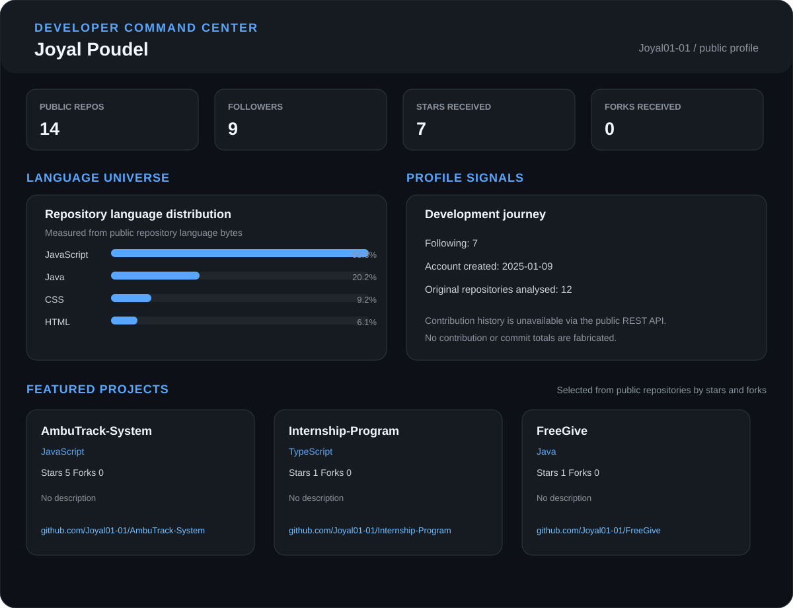

<!-- markdownlint-disable MD033 MD041 -->

<h1 align="center">Hi 👋, I'm Joyal Poudel</h1>

  

  
  
  

<h3 align="left">Connect with me:</h3>

  
  
  

<h3 align="left">Languages and Tools:</h3>

  
  
  
  
  
  
  
  
  
  
  
  
  

<!-- ==================== DEVELOPER COMMAND CENTER ==================== -->

<h2 align="center">⚡ Developer Command Center</h2>

  <em>Joyal Poudel · Building with web and software technologies</em>

  JavaScript · React · Node.js · Express.js · MySQL · Python · Django · Java

  

<!-- ==================== PROFILE ANIMATION ==================== -->

<!-- ==================== GITHUB STATISTICS ==================== -->

<h2 align="center">📊 GitHub Statistics</h2>

  <em>Code, contributions, languages, and GitHub activity</em>

  

  

  

  

  

  

  

  

<!-- ==================== FOOTER ==================== -->

