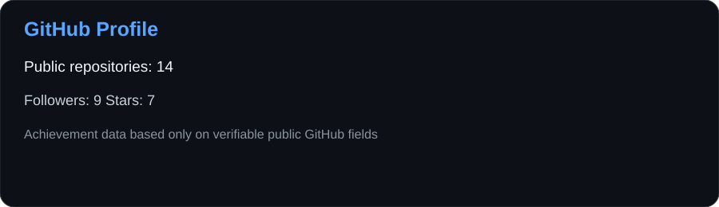
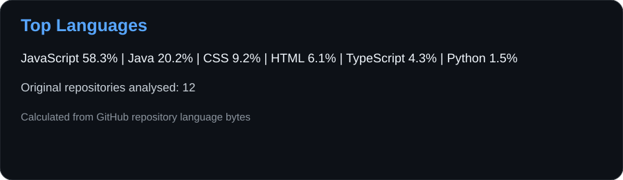
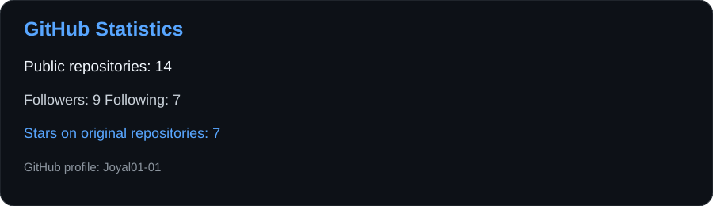
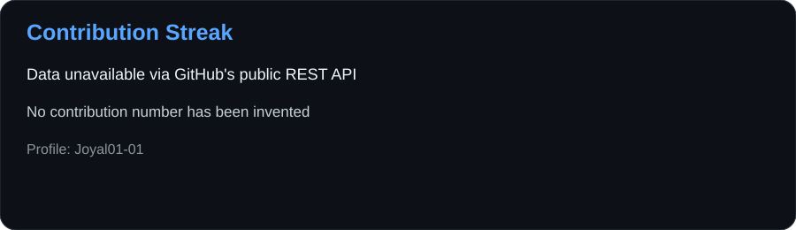
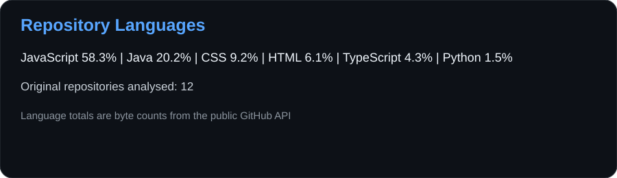
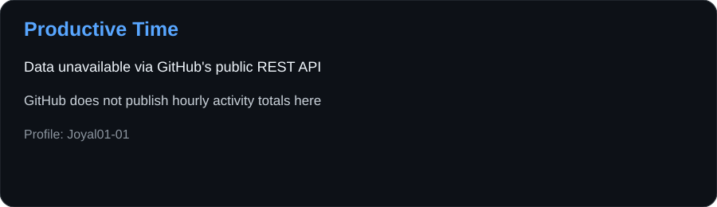
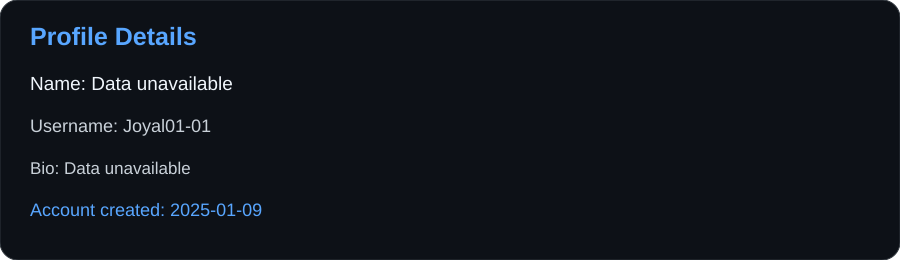

<h1 align="center">Hi 👋, I'm Joyal Poudel</h1>

<h3 align="left">Connect with me:</h3>

<h3 align="left">Languages and Tools:</h3>

<h3 align="left">Stars</h3>

<h3 align="center">Statistics</h3>

